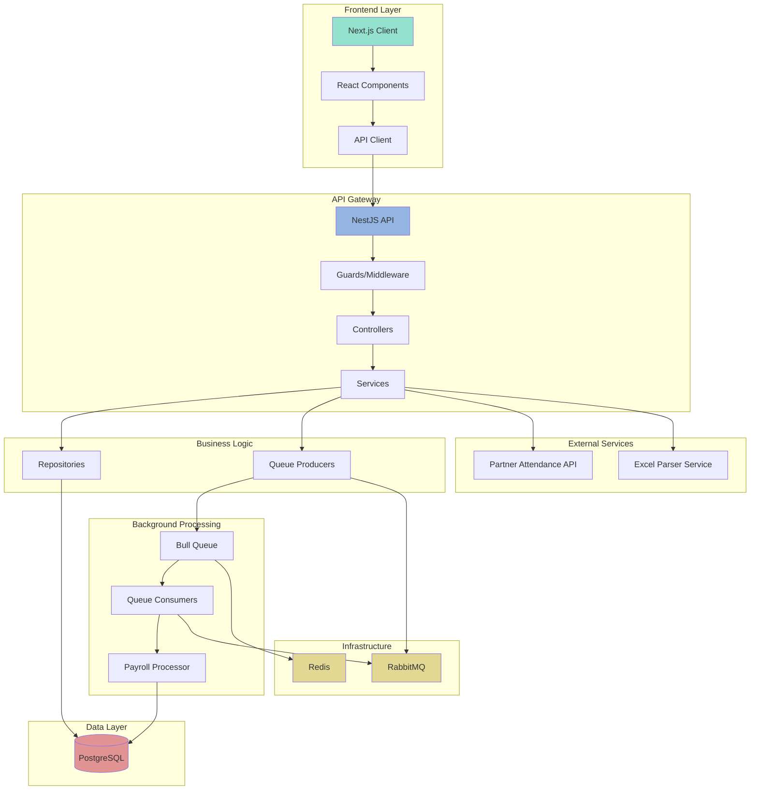

# 🏢 Payroll Management System

A modern payroll management system built with NestJS and Next.js that demonstrates best practices in software engineering, focusing on scalability, maintainability, and clean architecture.

## 👨‍💻 Author

**Nicolás Silva** ([@nicolascine](https://github.com/nicolascine))

## 🎯 Overview

This project showcases modern software engineering practices through a real-world payroll system implementation:

- Clean Architecture principles
- Queue-based processing for scalability
- Real-time monitoring
- Test-driven development
- Comprehensive documentation

## 🏗️ Architecture



## 🔄 Data Flow

1. **Frontend Flow**
   - Next.js client renders UI components
   - React components handle user interactions
   - API client manages backend communication

2. **API Gateway**
   - Guards/Middleware handle authentication and validation
   - Controllers route requests to appropriate services
   - Services orchestrate business logic

3. **Business Logic**
   - Repositories manage data persistence
   - Queue producers handle async job creation
   - External service integration

4. **Background Processing**
   - Bull Queue manages job queuing
   - Queue consumers process async tasks
   - Payroll processor handles calculations

5. **Data Layer**
   - PostgreSQL stores application data
   - Redis manages queue state
   - Data consistency across services

## 🛠️ Technology Stack

### Frontend Layer
- Next.js 14+
- React 18
- TailwindCSS
- TypeScript

### Backend Layer
- NestJS
- Bull Queue
- TypeORM
- Class Validator
- Swagger/OpenAPI

### Data Layer
- PostgreSQL (Main Database)
- Redis (Queue Management)

### DevOps
- Docker & Docker Compose
- Environment Configuration
- Health Checks

## ⚡ Key Features

- **Async Processing**: Bull Queue implementation for payroll calculations
- **Real-time Monitoring**: Bull Board integration
- **API Documentation**: OpenAPI/Swagger integration
- **Type Safety**: TypeScript throughout the stack
- **Data Validation**: Class-validator implementation
- **Error Handling**: Global exception filters
- **Security**: JWT, Helmet, Rate limiting

## 🚀 Quick Start

```bash
# Clone repository
git clone https://github.com/nicolascine/payroll-system
cd payroll-system

# Start services
make build
make up
```

Access points:
- 🖥️ Frontend: http://localhost:3000
- 🔌 API: http://localhost:3001
- 📊 Queue Monitor: http://localhost:3001/admin/queues
- 📚 API Docs: http://localhost:3001/api

## 💻 Development

```bash
# Install dependencies
make install

# Run tests
make test

# Run linter
make lint

# Access containers
make shell-backend
make shell-frontend
```

## 🏛️ Project Structure

```
.
├── backend/
│   ├── src/
│   │   ├── payroll/          # Payroll domain
│   │   ├── attendance/       # Attendance domain
│   │   ├── common/          # Shared utilities
│   │   └── main.ts          # Application entry
│   └── test/                # Test suites
├── frontend/
│   ├── src/
│   │   ├── components/      # React components
│   │   ├── pages/          # Next.js pages
│   │   └── services/       # API services
│   └── tests/              # Frontend tests
└── docker-compose.yml      # Container orchestration
```

## 🛠️ Best Practices Implemented

1. **Clean Architecture**
   - Domain-driven design
   - Separation of concerns
   - Dependency injection

2. **Testing Strategy**
   - Unit tests
   - Integration tests
   - E2E tests

3. **Code Quality**
   - ESLint configuration
   - Prettier formatting
   - Git hooks (husky)

4. **Performance**
   - Async job processing
   - Caching strategies
   - Database indexing

5. **Security**
   - Input validation
   - Rate limiting
   - JWT authentication
   - CORS protection

## 📚 Documentation

- [Demo Guide](DEMO.md) - Interactive demonstration
- [API Documentation](http://localhost:3001/api) - OpenAPI/Swagger
- [Queue Monitor](http://localhost:3001/admin/queues) - Bull Board

## 🤝 Contributing

1. Fork the repository
2. Create your feature branch
3. Commit your changes
4. Push to the branch
5. Create a Pull Request

## 📝 License

MIT License - see the [LICENSE](LICENSE) file for details